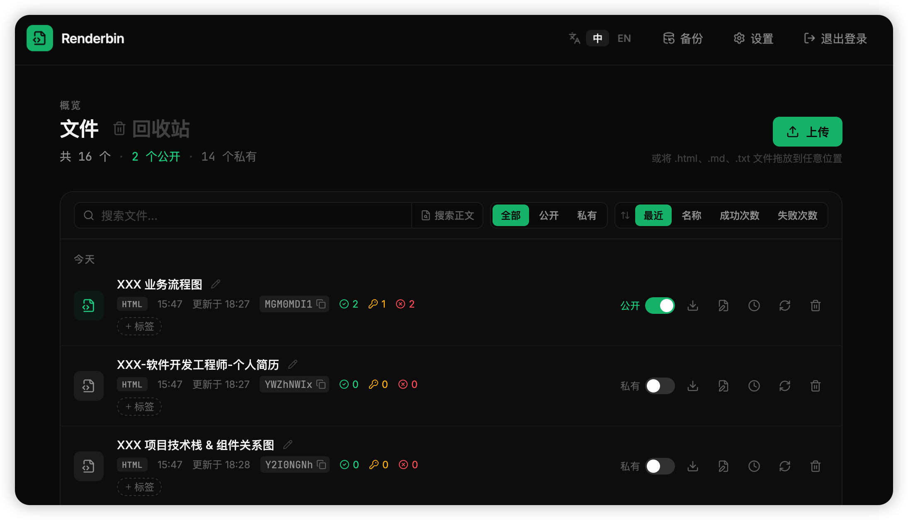

# Renderbin

**English** | [中文](#renderbin-中文)

A self-hosted service that turns **HTML, Markdown, and text files into shareable links** — built for the files your AI coding agent keeps producing.

Your agent finishes an analysis and hands you a self-contained `report.html` with an interactive chart inside. Pasting it into chat strips the styling and scripts; sending the file buries it in someone's `~/Downloads`; standing up S3 + CloudFront for one throwaway chart is absurd. So instead: **upload it, get a URL, send the URL** — it renders in the browser exactly as the agent authored it. With the built-in **MCP server**, the agent does all three itself and hands you the link in the same turn.

The name says the whole idea: a **bin** you throw things into and get a link back, like a pastebin — except the link **renders** the finished artifact instead of showing you its source.

Ships as a **single self-contained binary/container** — a Go API with the built SvelteKit frontend embedded — with all state in one SQLite file.



## Features

- **Upload** `.html`, `.md`/`.markdown`, `.txt` (picker or drag-and-drop, 5 MB each) — HTML served verbatim, Markdown rendered as GFM, text escaped and preformatted, all at the same link
- **Public / private** per file — public links are gated by a random access code (`/res/{slug}?code=...`)
- **Link expiry** after a time window (24h–30d) or a number of anonymous views; **custom slugs**; edit title/slug/code/source in place without breaking links
- **Tags**, search (by name, optionally file contents), filter/sort, day-grouped view, **trash & restore**
- **Per-file analytics** (session views / access-code views / blocked) and **one-click SQLite backup**
- **Multi-user** auth (bcrypt, DB-backed sessions surviving restarts) — the first account is the super admin, registration is toggleable
- **Bilingual UI** (English / 中文) and an **MCP server** for AI clients

## Quick start

No clone, no toolchain — grab the compose file and pull the prebuilt image:

```bash
curl -O https://raw.githubusercontent.com/shawn-bluce/renderbin/master/docker-compose.yml
docker compose up -d
```

Open http://127.0.0.1:8080 and create the first account on the welcome page — it becomes the **super admin**, and you choose there whether registration and MCP are on. There are no credential env vars; accounts live in the database.

Images are published to `ghcr.io/shawn-bluce/renderbin` for **linux/amd64 and linux/arm64**. Upgrade with `docker compose pull && docker compose up -d`. All state lives in the `db-data` volume (`/data/app.db` plus its WAL sidecars), which survives container recreation; migrations are forward-only and apply themselves on start. `docker compose down` is safe, `down -v` deletes the database.

Prefer no Docker? Every release attaches static linux binaries — no runtime dependencies at all:

```bash
curl -LO https://github.com/shawn-bluce/renderbin/releases/latest/download/renderbin_linux_amd64.tar.gz
tar xzf renderbin_linux_amd64.tar.gz && ./renderbin
```

`GET /api/health` reports the running version.

| Variable      | Default       | Description                      |
| ------------- | ------------- | -------------------------------- |
| `LISTEN_ADDR` | `:8080`       | Address the server binds to      |
| `DB_PATH`     | `data/app.db` | Path to the SQLite database file |

The container binds to `127.0.0.1:8080` only — put Nginx (or similar) in front to terminate TLS, since the session cookie is `Secure`. If the proxy rewrites the origin, forward `X-Forwarded-Proto` / `X-Forwarded-Host` so MCP-returned URLs stay correct.

## MCP

Enable MCP in **Settings → AI capability** to get a per-user API key, then point your client at `/mcp` (stateless streamable HTTP) with that key as a Bearer token:

```bash
claude mcp add --transport http renderbin https://your-host/mcp \
  --header "Authorization: Bearer rb_..."
```

Tools, all scoped to the key owner's own files: `upload_file`, `upload_files` (up to 20), `search_files`, `update_file`, `publish_file`, `delete_file` (two-step confirm, trash only — permanent deletion isn't exposed over MCP).

## Architecture

One process, one database file, no external services:

```
                    ┌──────────────────────────────────────────────┐
  browser  ────────▶│ /                → embedded SvelteKit SPA    │
  viewer   ────────▶│ /res/{slug}?code → rendered file (public)    │
  AI agent ────────▶│ /mcp             → MCP server (Bearer key)   │
                    │ /api/*           → JSON API (session cookie) │
                    └────────────────────┬─────────────────────────┘
                                         ▼
                                   SQLite (WAL)
```

- **Single binary.** The SvelteKit build is copied into `backend/internal/web/dist` and embedded via `//go:embed`, so one server serves both API and frontend — no Node in production.
- **Files never touch the filesystem.** Source is stored as text in SQLite; a file's `kind` (`html`/`markdown`/`txt`) is fixed at creation and decides only how it's rendered — access control is identical across kinds.
- **`/res/{slug}` gates itself** (no middleware): missing or trashed → 404 first; expired public files flip private on access (no cron); then the file's *owner* is served directly, and everyone else — anonymous or signed in as someone else — needs `is_public` plus a constant-time access-code match, else 403.
- **Sessions and migrations live in the DB** — logins survive restarts, and numbered forward-only `.sql` files apply themselves at startup.

```
backend/  cmd/server · internal/{db,auth,handlers,server,backup,web}
web/      src/lib/{api,schemas,components,i18n} · src/routes
```

## Tech stack

Everything here optimises for **one binary, zero dependencies, easy to self-host**:

- **Go** + [chi](https://github.com/go-chi/chi), [modernc.org/sqlite](https://pkg.go.dev/modernc.org/sqlite) (pure Go — `CGO_ENABLED=0` cross-compiles cleanly), [sqlc](https://sqlc.dev/) instead of an ORM, [goldmark](https://github.com/yuin/goldmark) for Markdown, bcrypt for passwords, the official [MCP Go SDK](https://github.com/modelcontextprotocol/go-sdk)
- **[SvelteKit 2](https://svelte.dev/docs/kit) + [Svelte 5](https://svelte.dev/)** as a pure SPA (`adapter-static`, runes only — no state library), [Tailwind v4](https://tailwindcss.com/), [Zod](https://zod.dev/) + [superforms](https://superforms.rocks/), [Vite](https://vite.dev/)/[Vitest](https://vitest.dev/), Lucide icons bundled locally
- Deliberately absent: microservices, message queue, Redis, ORM, and any CGO-based dependency

## Security notes

Uploaded content is served **unsanitized**, from the same origin as the app's own UI — that's the point of the tool, but it has consequences worth knowing before you expose it:

- **`html` and `markdown` reach the viewer with scripts intact** (`txt` is escaped and never executes). Opening a page you didn't author while signed in lets its JavaScript call the API as you. To host untrusted content, serve `/res` from a separate origin or add a CSP at your reverse proxy.
- **Every account is isolated**: files are scoped by owner in SQL, so another user's file is indistinguishable from one that doesn't exist. There is no super-admin exception — id=1 only gains the global settings toggles and the database backup, which is super-admin only because the snapshot contains every user's data. Note that MCP API keys are stored in plaintext, so anyone who can read the database file can use them.
- **No login rate limiting and no CSRF token** — bcrypt's per-attempt cost and `SameSite=Lax` are the accepted mitigations. There is no password-reset flow, and changing a password does not invalidate existing sessions (`DELETE FROM sessions` does).

Found a vulnerability? Please use GitHub's private **"Report a vulnerability"** button under the Security tab rather than opening a public issue.

## Development

```bash
make dev-api   # Go server on :8080
make dev-web   # Vite dev server on :5173 (proxies /api and /res, so no CORS setup)
```

Also `make build`, `make test`, `make check`, `make sqlc` — see the [`Makefile`](Makefile). Migrations are forward-only: add a new numbered file under `backend/internal/db/migrations/`, never edit an applied one, and run `make sqlc` after changing any query. Keep `make check` and `make test` green in a PR.

### Releasing

Pushing a `vX.Y.Z` tag is the only thing that publishes anything — plain pushes just run CI.

```bash
git tag -a v0.1.0 -m "First release" && git push origin v0.1.0
```

GitHub Actions re-runs the checks, then pushes a multi-arch image to `ghcr.io/shawn-bluce/renderbin` (tagged `0.1.0`, `0.1`, `latest`) and attaches static linux amd64/arm64 binaries to a GitHub Release. Pre-release tags like `v0.2.0-rc.1` never move `latest`. The tag is stamped into the binary and reported by `GET /api/health`.

## License

[MIT](LICENSE).

---

# Renderbin (中文)

[English](#renderbin) | **中文**

一个自托管服务，把 **HTML、Markdown 和文本文件变成可分享的链接**——专为 AI 编程助手不断产出的那些文件而做。

Agent 做完分析，交给你一个自包含的 `report.html`，里面还带着可交互图表。粘进聊天软件，样式和脚本被清洗掉；直接发文件，对方得去 `~/Downloads` 里翻；为一张一次性图表去搭 S3 + CloudFront 又太离谱。于是换个做法：**上传，拿链接，把链接发出去**——浏览器里的呈现和 Agent 写出来的一模一样。有了内置的 **MCP 服务**，这三步 Agent 自己就能完成，在同一轮对话里把链接递给你。

名字就是产品本身：一个像 pastebin 那样、把东西丢进去就能换回一条链接的 **bin**——区别在于链接打开的是**渲染**好的成品，而不是源码。

整个项目以**一个自包含的二进制/容器**发布——内嵌了构建好的 SvelteKit 前端的 Go API——所有状态都在一个 SQLite 文件里。


## 功能特性

- **上传** `.html`、`.md`/`.markdown`、`.txt`（选择或拖拽，单个 5 MB）——HTML 原样输出，Markdown 按 GFM 渲染，纯文本转义后预格式化，都在同一个链接上
- **公开 / 私有**逐文件设置——公开链接由随机访问码保护（`/res/{slug}?code=...`）
- **链接过期**：按时间（24h–30d）或匿名访问次数；支持**自定义 slug**；可就地修改标题/slug/访问码/正文而不破坏已有链接
- **标签**、搜索（按名称，可选搜正文）、筛选排序、按天分组视图、**回收站与恢复**
- **逐文件访问统计**（会话访问 / 访问码访问 / 被拒绝）与**一键 SQLite 备份**
- **多用户**认证（bcrypt，会话存库、重启后仍有效）——首个账号即超级管理员，注册可开关
- **双语界面**（English / 中文）与面向 AI 客户端的 **MCP 服务**

## 快速开始

不用 clone，不用装工具链——下载 compose 文件直接拉预构建镜像：

```bash
curl -O https://raw.githubusercontent.com/shawn-bluce/renderbin/master/docker-compose.yml
docker compose up -d
```

打开 http://127.0.0.1:8080，在欢迎页创建第一个账号——它即**超级管理员**，同时在那里选择是否开启注册和 MCP。没有凭据类环境变量，账号存在数据库里。

镜像发布在 `ghcr.io/shawn-bluce/renderbin`，提供 **linux/amd64 和 linux/arm64** 两个架构。升级用 `docker compose pull && docker compose up -d`。所有状态都在 `db-data` 卷里（`/data/app.db` 及其 WAL 附属文件），容器重建不受影响；迁移只向前，启动时自动应用。`docker compose down` 是安全的，`down -v` 会删库。

不想用 Docker？每个 release 都附带静态 Linux 二进制，没有任何运行时依赖：

```bash
curl -LO https://github.com/shawn-bluce/renderbin/releases/latest/download/renderbin_linux_amd64.tar.gz
tar xzf renderbin_linux_amd64.tar.gz && ./renderbin
```

`GET /api/health` 会返回当前运行的版本号。

| 变量          | 默认值        | 说明                  |
| ------------- | ------------- | --------------------- |
| `LISTEN_ADDR` | `:8080`       | 服务监听地址          |
| `DB_PATH`     | `data/app.db` | SQLite 数据库文件路径 |

容器只绑定 `127.0.0.1:8080`——生产环境请用 Nginx（或类似）在前面终止 TLS，因为会话 cookie 带 `Secure`。若代理改写了来源，需转发 `X-Forwarded-Proto` / `X-Forwarded-Host`，MCP 返回的 URL 才正确。

## MCP

在**设置 → AI 能力**中启用 MCP 即可获得每用户的 API Key，然后让客户端以该 Key 作为 Bearer Token 连接 `/mcp`（无状态 streamable HTTP）：

```bash
claude mcp add --transport http renderbin https://your-host/mcp \
  --header "Authorization: Bearer rb_..."
```

工具全部只作用于 Key 属主自己的文件：`upload_file`、`upload_files`（最多 20 个）、`search_files`、`update_file`、`publish_file`、`delete_file`（两段式确认，仅移入回收站——MCP 不提供永久删除）。

## 项目架构

一个进程、一个数据库文件，不依赖任何外部服务：

```
                    ┌──────────────────────────────────────────────┐
  浏览器    ───────▶│ /                → 内嵌的 SvelteKit SPA      │
  访问者    ───────▶│ /res/{slug}?code → 渲染后的文件（公开）      │
  AI Agent ────────▶│ /mcp             → MCP 服务（Bearer Key）    │
                    │ /api/*           → JSON API（会话 Cookie）   │
                    └────────────────────┬─────────────────────────┘
                                         ▼
                                   SQLite（WAL）
```

- **单二进制。** SvelteKit 构建产物被拷进 `backend/internal/web/dist` 并通过 `//go:embed` 嵌入，一个服务同时提供 API 和前端——生产环境没有 Node 进程。
- **文件从不落盘。** 源码以文本存在 SQLite 中；`kind`（`html`/`markdown`/`txt`）创建时确定，只决定如何渲染——三种格式的访问控制完全一致。
- **`/res/{slug}` 自己做鉴权**（不走中间件）：不存在或已删除 → 先 404；过期的公开文件在访问时被置为私有（无定时任务）；随后文件的**属主**直接放行，其他人——匿名访客或登录着的其他用户——都需要 `is_public` 且访问码常量时间比对通过，否则 403。
- **会话与迁移都在数据库里**——登录重启后仍有效，编号的只向前 `.sql` 迁移在启动时自动执行。

```
backend/  cmd/server · internal/{db,auth,handlers,server,backup,web}
web/      src/lib/{api,schemas,components,i18n} · src/routes
```

## 技术栈

所有选型都围绕**一个二进制、零依赖、易于自托管**：

- **Go** + [chi](https://github.com/go-chi/chi)、[modernc.org/sqlite](https://pkg.go.dev/modernc.org/sqlite)（纯 Go，`CGO_ENABLED=0` 可干净交叉编译）、用 [sqlc](https://sqlc.dev/) 而非 ORM、[goldmark](https://github.com/yuin/goldmark) 渲染 Markdown、bcrypt 处理密码、官方 [MCP Go SDK](https://github.com/modelcontextprotocol/go-sdk)
- **[SvelteKit 2](https://svelte.dev/docs/kit) + [Svelte 5](https://svelte.dev/)** 纯 SPA（`adapter-static`，只用 runes，无状态库）、[Tailwind v4](https://tailwindcss.com/)、[Zod](https://zod.dev/) + [superforms](https://superforms.rocks/)、[Vite](https://vite.dev/)/[Vitest](https://vitest.dev/)、本地打包的 Lucide 图标
- 有意不引入：微服务、消息队列、Redis、ORM，以及任何基于 CGO 的依赖

## 安全须知

上传的内容**不做任何净化**，且与应用自身的 UI 同源——这正是这个工具的意义所在，但在对外暴露之前有几点需要知道：

- **`html` 和 `markdown` 会带着脚本原样送达访问者**（`txt` 会被转义，永不执行）。在已登录状态下打开一个并非你自己撰写的页面，其中的 JavaScript 就能以你的身份调用 API。若要托管不受信任的内容，请把 `/res` 放到独立源，或在反向代理上加 CSP。
- **账号之间完全隔离**：文件在 SQL 层按属主过滤，别人的文件与不存在的文件不可区分。超级管理员没有例外——id=1 只是多了全局设置开关和数据库备份，而备份之所以限超管，是因为快照包含所有用户的数据。另外 MCP API Key 是明文存储的，能读到数据库文件的人就能使用它们。
- **没有登录限流，也没有 CSRF Token**——bcrypt 自身的单次开销和 `SameSite=Lax` 是已接受的缓解手段。没有找回密码流程；修改密码不会让已有会话失效（`DELETE FROM sessions` 才会）。

发现漏洞？请使用 GitHub Security 页签下的私密 **"Report a vulnerability"** 按钮，不要开公开 issue。

## 本地开发

```bash
make dev-api   # Go 服务，:8080
make dev-web   # Vite 开发服务器，:5173（代理 /api 和 /res，无需配置 CORS）
```

另有 `make build`、`make test`、`make check`、`make sqlc`——详见 [`Makefile`](Makefile)。迁移只向前：在 `backend/internal/db/migrations/` 下新增编号文件，绝不修改已应用的迁移；改动任何查询后运行 `make sqlc`。提 PR 前请保证 `make check` 和 `make test` 通过。

### 发布

推送 `vX.Y.Z` 形式的 tag 是唯一会产出发布物的操作——普通推送只跑 CI。

```bash
git tag -a v0.1.0 -m "First release" && git push origin v0.1.0
```

GitHub Actions 会重跑一遍检查，然后把多架构镜像推到 `ghcr.io/shawn-bluce/renderbin`（打上 `0.1.0`、`0.1`、`latest`），并把 linux amd64/arm64 的静态二进制附到 GitHub Release。`v0.2.0-rc.1` 这类预发布 tag 不会移动 `latest`。tag 会被写进二进制，可通过 `GET /api/health` 查看。

## 许可证

[MIT](LICENSE)。
